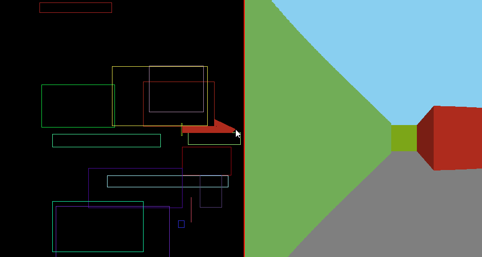

<h1 align="center">Raycaster</h1>

    

## About Raycaster

     

Raycaster is a small ray-casting engine (go figure!) written in Java. There are two perspectives: the left provides an overhead view of the raycasting, showing the ray collisions with the randomly-generated walls. The right side is a pseudo-3D view of the map, similar to how the original Wolfenstein 3D works.

## Dependencies

This program uses my Theta library. The JAR file is in that repository on my GitHub.

## Rebuilding Raycaster

Clone the repository to your computer and compile via your favorite IDE or terminal environment. Make sure to add the Theta JAR to the build path.

## Reporting Bugs

See the Issues Tab.

## Version History
The **master** branch encompasses all changes.